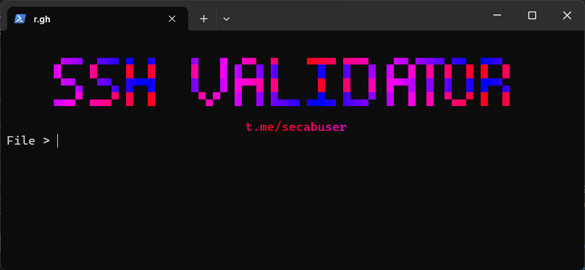

### **SSH Port & Login Checker**



> A fast, multi-threaded Python scanner for checking SSH (SshChecker) ;]

-----

### **Features**

  * **Fast & Multi-threaded:**
  * **Fully Flexible:** 
  * **Protocol Verification:** 

-----

### **Installation**

1.  **Install the libraries:**
    Open your terminal or command prompt, and run the command:
    ```bash
    pip install -r requirements.txt
    ```

-----

### **Usage**

1.  **Prepare your input file:**
      * Create a text file (e.g., `ips.txt`) with a list of IP:Port combinations. Supported format:
        ```
        192.168.1.1:22
        47.76.247.80:2222
        37.16.10.190:22
        ```
2.  **Run the script:**
    ```bash
    python main.py
    ```
      * The script will prompt you for the input file, number of threads, timeout, and names for both valid and invalid output files.

-----

📢 **Telegram Channel:** [t.me/secabuser](https://t.me/secabuser)
